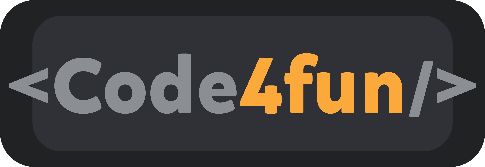

    

  
  

<blockquote align="center">“The key to transformation is continuity. Keep coding!”</blockquote>

 

  <a href="#sobre-a-next-level-week">About Code4fun</a>&nbsp;&nbsp;&nbsp;|&nbsp;&nbsp;&nbsp;
  <a href="#apresentação-da-aplicação">Fun Projects</a>&nbsp;&nbsp;&nbsp;

 

## About `<Code4fun/>`

    Code4fun's goal is to have fun while learning and practicing programming skills, in addition, also to discover new technologies to improve the skills acquired.
    And for this fun to happen, I will search for cool projects available on youtube and tutorials found on the web.

 

## Fun Projects

- [x] [BOOTSTRAP COURSE](bootstrap-course)

- [x] [PROJECT UI CLONE TWITTER](twitter-clone)
###### You can find the youtube video for this project [here](https://www.youtube.com/watch?v=K-8z_4xvT3o&t=6589s)!

- [x] [PROJECT UI CLONE DISCORD](ui_clone_discord)
###### You can find the youtube video for this project [here](https://www.youtube.com/watch?v=x4FdZd2-_uU&list=PLYnJaupNs4gzQ2QhA6gvEk63KGBBVuerJ)!

- [x] [SPECIAL DEV WORKSHOP](workshopDev)
###### You can find the youtube video for this project [here](https://www.youtube.com/playlist?list=PL85ITvJ7FLohGTWaE_p0J6B-TLmQbN4ka)!

 
 

<h3 align="center">
    
</h3>