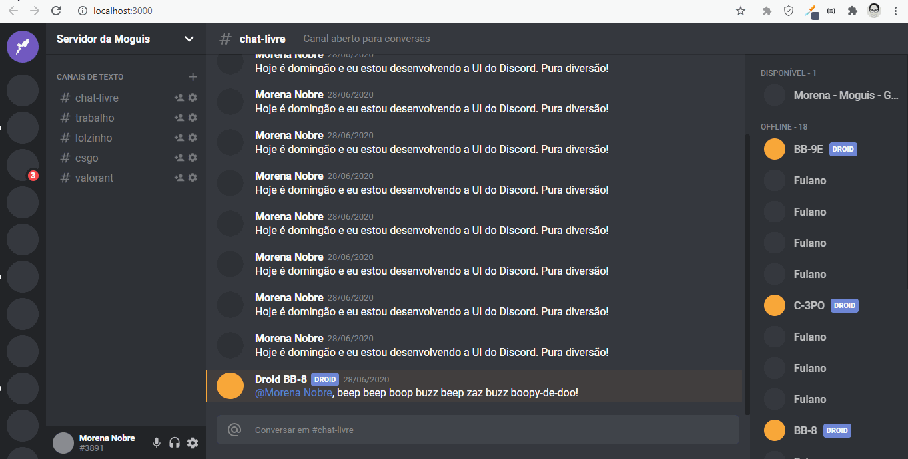

<h1 align="center">UI Clone - Discord</h1>

  
  

<blockquote align="center">“The key to transformation is continuity. Keep coding!”</blockquote>

 

Deployed <a href="https://uidiscord.netlify.app/" target="_blank">here</a>

  <a href="#apresentação-da-aplicação">Application Presentation</a>&nbsp;&nbsp;|&nbsp;
  <a href="#sobre-a-next-level-week">About UI Clone - Discord</a>&nbsp;&nbsp;&nbsp;|&nbsp;&nbsp;&nbsp;
  <a href="#sobre-a-next-level-week">Techs</a>&nbsp;&nbsp;&nbsp;|&nbsp;&nbsp;&nbsp;
  <a href="#apresentação-da-aplicação">Available Scripts</a>&nbsp;&nbsp;&nbsp;

 

## Application Presentation
 

  

 

## About UI Clone - Discord

    The UI Clone - Discord is part of the Code4fun project. This project was carried out and made available on youtube .

You can find the video <a href="https://www.youtube.com/watch?v=x4FdZd2-_uU&list=PLYnJaupNs4gzQ2QhA6gvEk63KGBBVuerJ">here</a>. Go there and have some fun too! Happy coding!

## Techs
- [x] React.js
- [x] Styled Components
- [x] TypeScript

## Available Scripts

In the project directory, you can run:

### `npm start`

Runs the app in the development mode. 
Open [http://localhost:3000](http://localhost:3000) to view it in the browser.

The page will reload if you make edits. 

<h3 align="center">
    
</h3>

