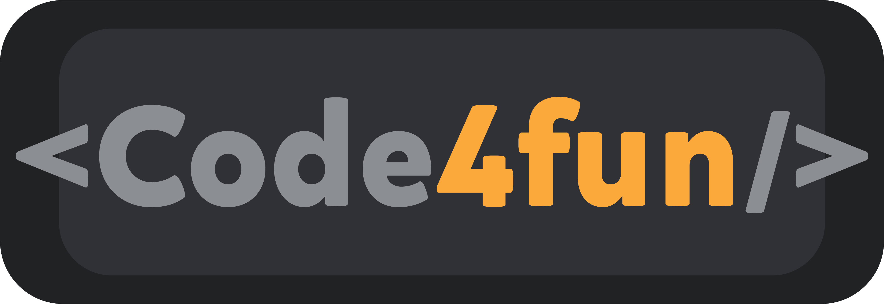

<h1 align="center">
    
</h1>
<h3 align="center">
  Special WorkshopDev - Criative House
</h3>

<blockquote align="center">“The key to transformation is continuity. Keep coding!.”</blockquote>

  <a href="#rocket-sobre-o-desafio">About the workshop</a>&nbsp;&nbsp;&nbsp;

## About the Workshop

Rocketseat launched a free web development workshop. The creation of a website to upload activities that can be done during quarantine.

### What is taught in the Workshop

The teachings range from site structure (frontend) to database (backend) :

- [x] Creation of layout and styling of the HTML of the main page, and ideas page.
- [x] Insertion of ideas by form.
- [x] When the user clicks on add new idea, a modal appears for him to fill.
- [x] Creating a server.
- [x] Database creation.

###### You can find the workshop [here](https://www.youtube.com/playlist?list=PL85ITvJ7FLohGTWaE_p0J6B-TLmQbN4ka) !

<h3 align="center">
    
</h3>